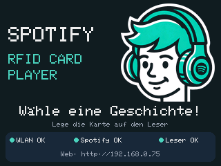
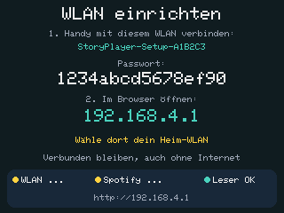

# ESP32 Spotify RFID Player

Play music on an Echo or another Spotify Connect speaker by placing an RFID card on a reader. Cards can select albums, playlists, tracks, or an artist's album catalog. An optional ILI9341 screen displays album artwork, while a local web dashboard provides playback controls and Spotify account setup.

```text
RFID card → ESP32 + MFRC522 → Spotify Web API → Spotify Connect speaker
                   ↕
             Web dashboard
```

The ESP32 controls playback; the speaker streams the audio. The speaker must already be available in Spotify Connect. The firmware cannot invoke Alexa to wake an unavailable Echo.

## Features

- Read Spotify links and URIs from supported NDEF cards.
- Play/pause, skip, adjust volume, and select a speaker from the web dashboard.
- Run with or without a TFT display, including account setup on screenless devices.
- Reconnect to Spotify through a device-hosted HTTPS page using OAuth with PKCE.
- Refresh access tokens automatically and persist replacement refresh tokens in flash.
- Renew the local HTTPS certificate automatically before it expires.
- Suppress repeated scans while a card stays on the reader.
- Recover reader communication, reconnect Wi-Fi, and retry transient playback failures.
- Inspect logs, reset reasons, memory statistics, reader health, and queued command results.

## Requirements

### Hardware

- An ESP32 development board with at least 4 MB flash for the documented partition layout.
- An MFRC522 RFID reader and supported NDEF cards.
- Optional ILI9341 TFT display.
- A stable power supply and Wi-Fi with internet access.
- An Echo or another speaker available to the same Spotify account through Spotify Connect.

The hardware-tested target is an **original ESP32**, using **ESP32 Dev Module** in Arduino IDE. A separate ESP32-C6 build profile is included, but C6 hardware and its pin mapping have not been validated. Select the board matching the actual chip.

### Software and account

- Arduino IDE or Arduino CLI.
- ESP32 Arduino core **3.3.11** and the libraries pinned in [sketch.yaml](sketch.yaml).
- Python 3 and OpenSSL for initial HTTPS provisioning.
- A Spotify developer app and a Spotify Premium account. Spotify requires Premium for [Web API playback control](https://developer.spotify.com/documentation/web-api/reference/start-a-users-playback).

## Wiring

The default pin assignments are for the original ESP32:

| Signal | ESP32 GPIO | Connection |
| --- | --- | --- |
| SPI SCK | 18 | Reader and optional TFT clock |
| SPI MISO | 19 | Reader and optional TFT MISO |
| SPI MOSI | 23 | Reader and optional TFT MOSI |
| RFID CS / SDA | 5 | MFRC522 chip select |
| RFID reset | 4 | MFRC522 reset |
| TFT CS | 15 | Optional display chip select |
| TFT DC | 2 | Optional display data/command |
| TFT reset | 22 | Optional display reset |

Use a common ground and the supply voltage required by each module. The reader and display share SPI, with separate chip-select signals. Screenless builds keep the same reader pin assignments.

## Setup

### 1. Configure the player

Open `esp32SpotifyAlexa_v5_tft_ndef.ino` in Arduino IDE, or run the following commands from the project directory.

```sh
cp secrets.example.h secrets.h
```

Edit `secrets.h` with your initial Wi-Fi credentials, Spotify app credentials,
and target speaker name. The speaker name should match the name shown by Spotify.
Wi-Fi entered later through setup takes precedence over these initial credentials;
changing networks does not require reflashing.

Leave `refreshToken` empty to authorize through the web dashboard. It is an optional bootstrap credential: once a token is saved on the device, the saved token takes precedence over this field.

For a screenless player, set `PLAYER_HAS_DISPLAY` to `0` in
[DeviceConfig.h](DeviceConfig.h). The default is `1` for the TFT version.
For a reader-isolation test, `0` disables display traffic while keeping RFID,
Spotify, and the web dashboard enabled; it does not electrically disconnect
the display module.

### 2. Provision HTTPS

Generate the player's local HTTPS identity before compiling:

```sh
python3 tools/provision_https.py --hostname spotify-player
```

This creates:

- `DeviceCertificate.h`: private identity material included in the firmware.
- `https-auto-private/`: certificate authority, certificates, and private keys.

Trust **`https-auto-private/ca.crt`** on the computer or phone used for Spotify reconnect. Without this trust step, the browser will show a certificate warning. The certificate is issued by your local authority, not a publicly trusted authority.

Keep these generated files private. They are excluded by `.gitignore`, along with `secrets.h`. Do not publish firmware binaries containing your credentials or keys.

Detailed trust and renewal instructions are in [Device-hosted Spotify reauthentication](DEVICE_REAUTH.md).

### 3. Register the Spotify redirect

In the settings for the Spotify developer app matching your `clientId`, add this exact redirect URI:

```text
https://spotify-player.local/callback
```

The scheme, hostname, path, and trailing slash must match the firmware's redirect exactly. For a different provisioned hostname, change the registered URI accordingly.

### 4. Build and upload

In Arduino IDE, install the dependencies listed in [sketch.yaml](sketch.yaml), then select:

| Setting | Value |
| --- | --- |
| Board | ESP32 Dev Module |
| Flash size | Match the physical board; at least 4 MB for this layout |
| Partition scheme | Minimal SPIFFS (1.9MB APP with OTA/128KB SPIFFS) |
| Erase All Flash | Disabled when preserving saved settings |
| Serial Monitor baud rate | 115200 |

The default application partition is too small. The documented layout provides a **1,966,080-byte application slot**. Although the partition scheme reserves OTA slots, the project does **not** implement firmware OTA updates. Back up an existing device before changing its partition layout.

Arduino CLI can use the pinned profile, downloading dependencies as needed:

```sh
arduino-cli compile --profile esp32-review .
```

For a screenless build without editing `DeviceConfig.h`:

```sh
arduino-cli compile --profile esp32-review \
  --build-property 'compiler.cpp.extra_flags=-DPLAYER_HAS_DISPLAY=0' .
```

Upload through Arduino IDE, or use the same CLI profile and your device's serial port:

```sh
arduino-cli upload --profile esp32-review --port /path/to/serial-port .
```

### 5. Connect Spotify

1. Open `http://spotify-player.local/`, or the IP address printed in Serial Monitor.
2. Click **Reconnect Spotify**. This opens the player's HTTPS hostname, even if you opened the dashboard by IP.
3. Sign in to Spotify and approve access.
4. Wait for **Spotify reconnected and saved**.
5. Return to the dashboard and click **Test saved refresh token**.
6. Use **Find speakers**, choose the target, and click **Save default speaker**.
7. Scan a programmed card.

To verify persistence, reboot the player and run **Test saved refresh token** again. A pass confirms that the restored refresh token can obtain a new access token.

## Display

The optional TFT opens with the supplied headphone logo and a “Pick a story!”
prompt for audiobook listening. A compact strip shows Wi-Fi, Spotify authorization, reader status,
and the local web address. Connection or reader problems replace the prompt
with a short message; a missing/rejected credential asks a grown-up to connect
Spotify through the web dashboard.

The logo is a static RGB565 bitmap stored in flash (about 39 KB).
Its edited source is in `assets/player-head-source.png`; regenerate the firmware
header with `python3 tools/encode_player_logo.py` (requires Pillow).



The illustration is static. While this screen is visible, the firmware checks
for status changes once a second and redraws only the message/status area when
needed. Album artwork takes over during playback; the dashboard's **Show startup screen**
button brings the companion back. The startup screen stays visible for 30 minutes, including when opened with the
button. Cover duration is configurable below. These indicators report connectivity and authorization, not a
guarantee that the selected speaker is available.

### Web dashboard

The dashboard has three main pages, with a single column on phones and two
columns for player controls and diagnostics on larger screens. The logo is
embedded locally; no external fonts, scripts or image services are needed.

- **Player:** connection badges, default speaker, playback/volume controls, and
  startup/cover screen buttons. Connection problems appear above the controls.
- **Settings:** expandable Speaker, Display, Spotify connection, and Wi-Fi
  sections. Manual refresh-token replacement is under Spotify → Advanced.
- **Diagnostics:** health summary, technical details, token test, live logs with
  pause/copy controls, TFT debug mode, and reader/player recovery controls.

Logs are fetched only while Diagnostics is open and not paused. Copy logs works
on local HTTP using a clipboard fallback; if the browser rejects copying, select
the text manually. Screenless players hide TFT controls. The existing
`#speakerSetup` link from Wi-Fi provisioning still opens speaker settings.

### Live logs and cover duration

Choose cover time in **Settings → Display**, or enable **Show live logs on TFT**
in **Diagnostics**, then click **Save display settings**. Both settings survive restarts.

- Live-log mode replaces artwork with the latest 18 wrapped lines from the same
  application log shown in the dashboard. It refreshes only when new messages
  arrive, at most once per second. It does not capture ROM/panic output or enable
  the separate verbose RFID build option. Turning it off restores the latest
  cached cover, or the info screen if no cover is cached.
- Cover time is entered in **minutes** (decimals allowed, up to **1440**); **0** keeps covers visible until replaced or
  manually cleared. The default is **10 minutes**. Existing saved durations are preserved. Changing the duration applies
  to the currently displayed cover's elapsed time. When it expires, the startup
  screen appears for 30 minutes, then the display goes blank. Audio continues.
  A cover time of 0 keeps the cover visible until another display action.
- Wi-Fi setup instructions take priority over live logs, artwork, and blanking.
  Manual display buttons are disabled while setup or live-log mode is active.

### Startup readiness

Cards presented before Wi-Fi, clock synchronization or Spotify authentication
are ready remain queued; a newer card replaces the waiting request. Startup
refresh checks readiness every second, honoring network cooldowns. Normal
auth maintenance remains every 30 seconds. Revoked or invalid credentials still
require reconnecting Spotify.

### Card feedback and loading animation

A newly selected card immediately shows an animated storybook, before NDEF
reading or any Spotify request. Page turning and story sparks update every
120 ms in a small screen region; the reader/display worker owns all SPI drawing.
The full-quality cover replaces the animation as soon as it is downloaded and
validated. Wi-Fi setup and TFT debug mode keep their existing priority.

Unsupported cards and read failures have distinct localized error screens.
Playback failures, unavailable covers and a full command queue also give feedback.
Errors remain for five seconds, then return to the startup screen; another card
can replace them immediately. Loading returns to the startup screen after 90
seconds if no cover arrives, without cancelling a pending playback request.
A held card does not restart the animation. Older results cannot replace a newer
card's loading screen or error.

### Cover loading and retry

Album cards (including albums chosen for artist cards) and track cards request
artwork from their own metadata. If a large album response exceeds the bounded
JSON limit, the player falls back to playback metadata and checks that it matches
the requested album/track. Other contexts use currently-playing metadata.
Failed artwork requests retry up to three attempts while the command queue is idle.
Playback does not restart during these retries.

**Last cover** redraws the cached image; if no image is cached, it requests one.
**Reload cover** fetches artwork again without changing playback. Look for `[Art]`
log lines reporting metadata/download/memory problems or confirming the cover
was drawn. Cover downloads establish HTTPS before allocating JPEG storage. Known-size
images allocate only their reported size, bounded by available contiguous memory
and 64 KB, with 16 KB remaining working space while TLS is live. When the preferred JPEG fits the 64 KB limit but not the live HTTPS memory
budget, it downloads through a temporary SPIFFS file, closes HTTPS, then sends the file to the display worker for direct JPEG decoding. It never
allocates the complete file in RAM. This uses the documented 128 KB SPIFFS partition. Only an
entirely erased partition is automatically formatted; existing data is preserved
on mount failure. Temporary files are removed after decoding (or queue/download failure). This fallback writes
flash; downloads that fit RAM do not. Images narrower than 240 pixels are never selected; if no suitable cover can
be displayed, the failure is logged instead of showing a pixelated thumbnail. Logs report buffer capacity and known JPEG size; local
code 413 means the cover exceeded the buffer. Covers scale to fill 320×240 with centered cropping and preserved aspect ratio.
For the RAM download path, JPEGs larger than 24 KB are
released after display so subsequent Spotify HTTPS requests have enough RAM;
Last cover fetches again for those images and requires a network connection.
Successful playback alone does not mean the artwork loaded.

Refreshing the dashboard only reads status, cached speakers and logs. Click
**Find speakers** to request fresh Spotify speaker discovery.

### Screen language

In the web dashboard, open **Settings → Display → Screen language**, choose **English**,
**Deutsch**, **Français**, or **Español**, then click **Save language**. The choice
is saved on the device and survives restarts. If saving fails, the previous
setting stays active. Devices without a saved choice default to German.

Prompts, connection messages, and reader labels on the TFT use the selected
language, including accented characters. The logo stays unchanged. The info
screen updates without a reboot; if artwork is showing, use **Device info** to
view it. The maintenance dashboard and diagnostic logs remain in English.

## Changing Wi-Fi without a computer

After 30 seconds without a Wi-Fi connection, the player creates a
password-protected setup network. You can also open the normal dashboard and
click **Change Wi-Fi** to start setup while the old network is still available.

1. Read the **WLAN einrichten / Wi-Fi setup** instructions on the TFT.
2. On your phone, join the displayed `StoryPlayer-Setup-XXXXXX` network using
   the displayed setup password. Stay connected if the phone warns that the
   network has no internet.
3. Open the setup page automatically offered by your phone, or enter
   **http://192.168.4.1** in its browser. Use HTTP, not HTTPS.
4. Find nearby networks or enter the SSID manually, enter the Wi-Fi password,
   and choose **Connect and save**. An empty password selects an open network.
5. Wait for confirmation, then reconnect your phone to your home Wi-Fi.
   The setup network closes 30 seconds after a successful save.
6. Follow **Choose the default Echo** on the confirmation page to open the
   player's dashboard on the new network. Click **Find speakers**, choose your
   Echo, then **Save default speaker**. Wait for the saved confirmation before
   scanning a card. The TFT also shows this next step and the new web address.



The pictured password and network suffix are examples. Each player generates and
stores its own setup password. The dashboard's **Wi-Fi setup** section and USB
Serial output at 115200 baud also show it. For a screenless player, keep those
details on a label before moving it to another network; USB Serial remains an
offline fallback if the label is unavailable.

The player tests a new connection for up to 30 seconds. It saves only after
joining the requested network, obtaining an IP address, and staying connected
for three seconds. This verifies Wi-Fi access, not internet or Spotify service.
Failed connection tests and failed credential writes retain the previous saved
credentials and return to that network. **Cancel / previous Wi-Fi** abandons a
pending attempt. The setup network remains available after failure so you can
correct the password. An automatically opened portal closes after the saved network returns and
stays connected for ten continuous seconds. A connection drop restarts that
timer. A portal opened with **Change Wi-Fi**, or used to scan/test new credentials,
stays open until setup succeeds or you cancel it.

Spotify tokens, speaker selection, HTTPS identity, and language settings are
preserved. The setup network does not provide internet access. When the player
joins a router on a different Wi-Fi channel, the phone may briefly disconnect;
rejoin the setup network and reopen the page to check the result. The TFT setup
instructions and phone page support English, German, French, and Spanish. Setup
instructions take priority over cover art and the normal screen timeout.

The portal is intended for ordinary home Wi-Fi (2.4 GHz on the original ESP32),
not enterprise authentication or networks requiring a separate hotel-style login.

## Default Echo / speaker

The dashboard's **Default Echo / speaker** section shows the current default and
lets you discover and save another Spotify Connect speaker. The saved name is
restored at boot and the current device ID is rediscovered as needed. Choose
unique names for your Echo devices so rediscovery identifies the intended one.
The speaker must be available in Spotify and the player must be authorized.

Choosing a default requests a playback transfer with `play: false`, so setup does
not automatically start audio (it can pause existing playback). The firmware
validates the selected ID/name against Spotify's current device list before
transfer and saving. A failed save retains the previous firmware default; a
transfer may already have taken place. The dashboard confirms success only when
the queued job completes. Reconnect Spotify if the device is not authorized,
then return to this section.

## Preparing and using cards

Program cards with a separate NFC writing app or tool; this project reads cards but does not write them.

Supported content includes UTF-8 NDEF Text records and NDEF URI records containing:

```text
spotify:album:<22-character ID>
spotify:playlist:<22-character ID>
spotify:track:<22-character ID>
spotify:artist:<22-character ID>
https://open.spotify.com/<type>/<22-character ID>
```

Spotify URL query strings are accepted. Artist cards select from a shuffled album/single catalog.

Supported cards are MIFARE Classic 1K with NDEF keys and NFC Forum Type 2 Ultralight/NTAG cards with an accessible capability container. Reads are bounded to 1008 bytes of card data, 768 bytes of NDEF message data, and 16 records. UTF-16 text, chunked records, and unsupported URL formats are rejected.

A held card triggers once. Remove it for approximately **1.5 seconds** before presenting the same card again, including after a failed read. A different card can trigger immediately. Reader faults do not count as card removal.

## Screenless and multiple players

Screenless builds retain RFID, playback controls, diagnostics, and the full browser reconnect flow. They omit TFT/JPEG support and artwork downloads.

Use the same source code for multiple players, but provision a **unique hostname and HTTPS identity for each device**. Do not flash the same identity to two players on the same network.

For example, preserve the first player's generated header, then provision a second identity:

```sh
cp DeviceCertificate.h https-auto-private/DeviceCertificate.h
python3 tools/provision_https.py --hostname spotify-player-2 \
  --directory https-auto-private/player-2 \
  --header https-auto-private/player-2/DeviceCertificate.h
cp https-auto-private/player-2/DeviceCertificate.h DeviceCertificate.h
```

Register `https://spotify-player-2.local/callback` in the Spotify app, trust the second player's `ca.crt`, configure its intended speaker, and compile with the appropriate display setting and board target. Authorize the second player through its own dashboard.

Restore the first player's header before rebuilding for it:

```sh
cp https-auto-private/DeviceCertificate.h DeviceCertificate.h
```

## Authentication and long-term operation

Access tokens refresh automatically. When Spotify supplies a replacement refresh token, the firmware saves it together with its authorization mode. Browser reconnect also saves the credential to nonvolatile storage. Failed validation of a manually submitted replacement preserves the existing connection.

The log message **Token refreshed** means a new *access token* was obtained; it does not establish that the refresh-token value changed. **Browser reconnect saved** confirms that the browser authorization flow completed and its credential was saved.

The HTTPS leaf certificate lasts 397 days and renews on the device 90 days before expiry. Renewal also handles an expired leaf after a long power-off, once network time is available. Normal renewal does not require reflashing or trusting another CA. The provisioned authority lasts about ten years; replacing that authority eventually requires provisioning and browser trust again.

Revoked or rejected Spotify credentials still require browser reauthorization. Internet access, correct network time, Spotify API availability, and a reachable speaker remain dependencies. The firmware cannot guarantee years of operation without intervention.

### Local web access

Device login is **disabled by default** for use on a trusted internal LAN. Anyone with access to that LAN can operate the dashboard; do not expose it directly to the internet.

Set `PLAYER_REQUIRE_WEB_AUTH` to `1` in [DeviceConfig.h](DeviceConfig.h) to enable device authentication. That mode prints the stored admin credentials over USB Serial at 115200 baud. Browser Origin/CSRF checks and browser-bound OAuth state are enabled in both modes. Outbound Spotify and artwork connections verify TLS certificates.

### Optional computer-based token helpers

The normal reconnect flow runs on the player. Python helpers are also available as a fallback:

```sh
python3 -m venv .venv
source .venv/bin/activate
python3 -m pip install -r requirements.txt
```

Set `SPOTIFY_CLIENT_ID` and `SPOTIFY_CLIENT_SECRET` in the environment and register `http://127.0.0.1:8080/callback` in the same Spotify app.

```sh
python3 getrefreshtoken.py --output spotify-refresh.token
python3 renew_token.py --url http://spotify-player.local
```

The first command writes a token to a new private file without printing it. The second authorizes and submits a token to the player, then waits for the actual job result; it prompts for the device admin password or uses `ESP32_ADMIN_PASSWORD`. Keep token files private.

## Troubleshooting

| Symptom | What to check |
| --- | --- |
| `text section exceeds available space` | Select the documented Minimal SPIFFS partition scheme. |
| `This chip is ESP32, not ESP32-C6` | Select ESP32 Dev Module for an original ESP32. |
| `redirect_uri: Not matching configuration` | Register the exact HTTPS callback for this player's hostname in the app matching its client ID. |
| `ERR_CERT_AUTHORITY_INVALID` | Trust this player's generated `ca.crt` on the browser's device. |
| Dashboard works by IP but reconnect does not | The browser must resolve the provisioned `.local` hostname for HTTPS reconnect. |
| HTTPS handshake errors | Check certificate trust and hostname. A failed browser TLS connection alone does not mean an already completed token exchange failed. |
| Speaker missing or playback rejected | Make the speaker available through Spotify, then find and select it again. |
| Repeated RFID recovery failures | Inspect the logged reader registers, power, reset, and SPI connections. A single pre-initialization zero-register diagnostic is not itself a failure. |
| Same card does not retrigger | Remove it for at least about 1.5 seconds before presenting it again. |
| Black display | Confirm the boot banner reports `TFT=1`, then check display connections and power. |
| Error `507` after a credential update | The credential is usable in RAM but flash persistence failed. Avoid rebooting until the save warning clears. |
| Unexpected reboot | Capture the full Serial Monitor output before and after the boot banner, including reset reason and any panic, brownout, or watchdog messages. |

Reader logs are concise by default: one line per completed recovery, and an
unavailable-reader warning at most once every 30 seconds during a continuous
failure. Scan, removal, and failed card-read messages remain visible. Set
`PLAYER_RFID_DEBUG` to `1` in `DeviceConfig.h` to restore register dumps,
recovery-trigger details, and individual selection errors. Recovery behavior
and diagnostic counters are unchanged.

Dashboard commands are asynchronous: **202 plus a job ID means queued**, not completed. The dashboard polls for the result; successful Spotify operations commonly return 200 or 204. Only the latest eight job outcomes are retained.

## Code organization

| File | Responsibility |
| --- | --- |
| [Main sketch](esp32SpotifyAlexa_v5_tft_ndef.ino) | Startup, task coordination, hardware, and HTTP routes |
| [SpotifyClient.cpp](SpotifyClient.cpp) | Spotify API, access-token refresh, playback, and rate limiting |
| [Dashboard.h](Dashboard.h) | Browser dashboard and job polling |
| [SafeNdef.h](SafeNdef.h), [RfidReader.h](RfidReader.h) | Bounded NDEF parsing and card reads |
| [RfidPresence.h](RfidPresence.h), [RfidRecovery.h](RfidRecovery.h) | Held-card detection and hardware recovery |
| [DeviceAuth.cpp](DeviceAuth.cpp), [OAuthSession.h](OAuthSession.h) | HTTPS reconnect and PKCE sessions |
| [DeviceIdentity.cpp](DeviceIdentity.cpp), [CertificatePolicy.h](CertificatePolicy.h) | Certificate persistence and automatic renewal |
| [tools/provision_https.py](tools/provision_https.py) | Initial local HTTPS provisioning |

A hardware worker owns the shared SPI reader/display operations. A separate network worker processes Spotify jobs, so network requests do not directly block reader polling. Queues, response sizes, artwork buffers, and retries are bounded.

## Tests and reliability validation

Run the host regression suite:

```sh
python3 tests/run_tests.py --arduino-json /path/to/ArduinoJson/src
```

The suite uses Clang with AddressSanitizer/UndefinedBehaviorSanitizer, ArduinoJson 7.4.3 sources, Node.js, and the Python dependencies in `requirements.txt`. The current native HTTPS test harness uses macOS CommonCrypto.

Coverage includes malformed NDEF data, card capacity boundaries, held-card behavior, reader recovery, Spotify token rotation and persistence, API retries, rate limiting, HTTPS authorization handlers, certificate policy, and dashboard job results. Hardware and transport are mocked in these tests.

For certificate generation with real Mbed TLS, build Mbed TLS 3.6.6 locally with programs and tests disabled, provision the local identity, then run:

```sh
python3 tests/run_identity_tests.py --mbedtls /path/to/mbedtls-3.6.6
```

This exercises certificate generation and persistence with real cryptography and independent OpenSSL verification.

**Long-duration hardware reliability is still being validated.** Before unattended use, run at least a 72-hour soak covering held cards, repeated scans, Wi-Fi outages, speaker disappearance, and token refresh followed by reboot. Monitor reader recovery counts, polling gaps, free/minimum heap, task stack headroom, and reset reasons.

See [review/FIXES.md](review/FIXES.md) for the implementation history and [DEVICE_REAUTH.md](DEVICE_REAUTH.md) for detailed reconnect acceptance tests.
